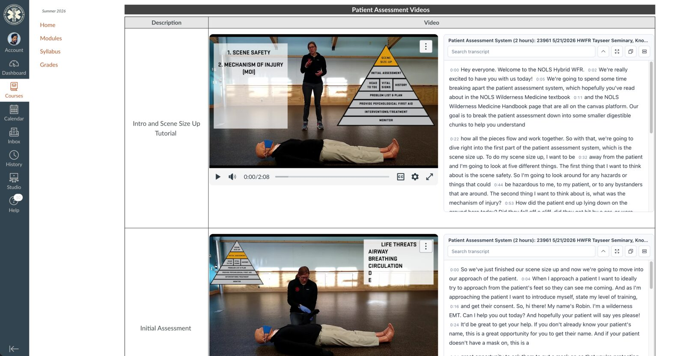
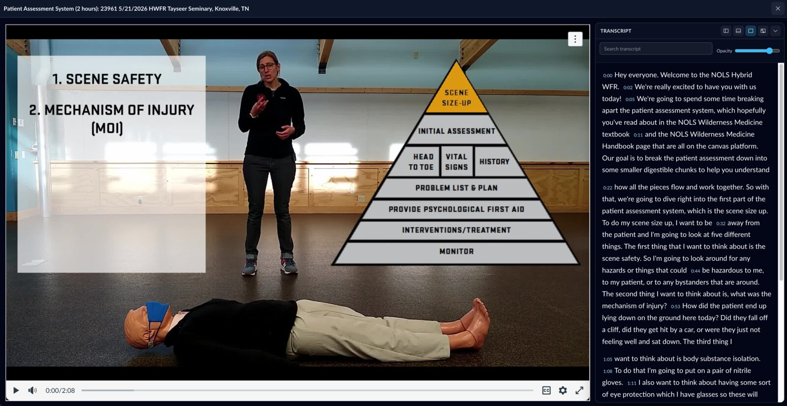
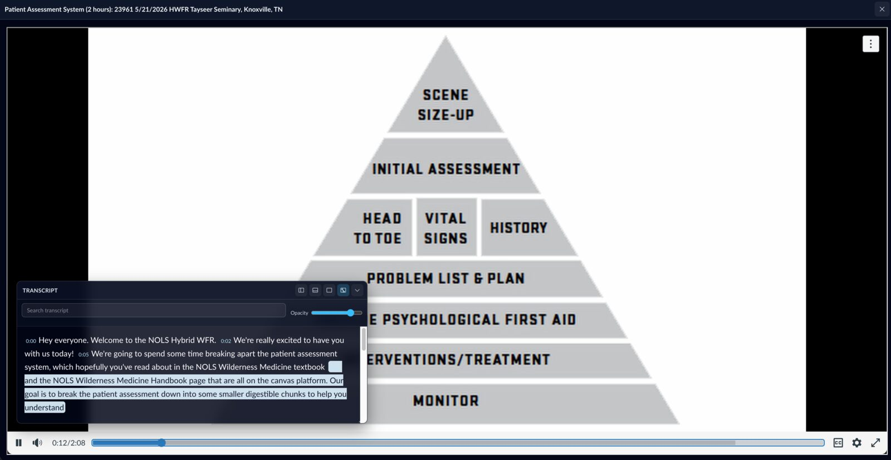

# Canvas Transcript Companion

A Chrome extension that adds a synced, clickable transcript panel to Canvas video pages when captions are available. Built for Canvas Studio / Arc embeds on `*.instructure.com`, `*.instructuremedia.com`, and `*.canvaslms.com`.



## Features

- **Synced transcript panel** — appears next to or below the embedded video, populated from the video's text tracks or fetched WebVTT/SRT.
- **Active-cue highlight** — current sentence is highlighted as playback moves.
- **Click to seek** — clicking any transcript line jumps the video to that point.
- **Search & highlight** — filter the transcript with live highlighting; works in both panel and theater modes.
- **Theater mode** — full-window distraction-free view. The transcript can be:
  - docked **right** (default), **left**, or **bottom**
  - dragged and resized as a **floating** panel
  - made **transparent** via an opacity slider hidden behind an icon
  - **collapsed** to its title bar
- **Copy transcript** — one-click copy of the entire transcript.
- **Local diagnostics** — built-in debug panel for troubleshooting cue extraction and frame messaging.

No telemetry. Everything runs locally in your browser.

## Install (unpacked)

Until this is published to the Chrome Web Store, install it as an unpacked extension:

1. Download the latest release zip from the [Releases page](../../releases) and unzip it, or clone this repo.
2. Open `chrome://extensions`.
3. Enable **Developer mode** (top-right toggle).
4. Click **Load unpacked**.
5. Select the `extension/` folder.
6. Open any Canvas page that has a captioned Studio video. The transcript appears beside or below the player once captions are detected.

## Usage

- **Click a sentence** to seek the video to that timestamp.
- **Search** filters and highlights matches across the transcript.
- **Theater button** (corners-out icon, top-right of the panel) opens the full-window theater view.
- In theater mode:
  - **Dock buttons** in the transcript title bar switch the dock position.
  - **Float** mode lets you drag the transcript by its title bar and resize from the corner.
  - **Opacity** icon (circle-half) opens a slider so the transcript can fade into the background.
  - **Red X** in the top-right closes theater. **Esc** also closes it.

### Theater mode — docked right (default)



### Theater mode — floating, with opacity slider



## How it works

1. A `page-monitor.js` script runs in the page's main world to observe `fetch`/`XMLHttpRequest` for Canvas caption endpoints.
2. The main `content.js` runs in every frame (top page and Studio iframes), discovers `<video>` elements, extracts cues from `textTracks` or by fetching the WebVTT/SRT, and forwards them to the top frame.
3. The top frame renders the transcript shell next to each Studio video target and wires seek/highlight messaging back to the originating video frame via `postMessage`.

The architecture is per-frame and per-video, so multiple Studio embeds on one page each get their own transcript panel.

## Diagnostics

Click **Debug** in the transcript panel to open the diagnostics view. It shows:

- Whether the top Canvas page saw Studio/video frames.
- Whether the video frame found a `<video>`, text tracks, and cue counts.
- Recent caption/transcript-related network hints.
- Recent extension events.

For noisy console logging, add `?ctcDebug=1` to the URL or run `localStorage.setItem("ctcDebug", "1")` in the page console. Diagnostics are local-only; nothing is sent off-device.

## Known limitations

- **Word-level highlighting** depends on the caption source exposing word timings. Most WebVTT/SRT captions only carry sentence/phrase timings, so highlighting is per-cue.
- **Studio-only transcripts** (where Canvas Studio holds a downloadable transcript but never feeds cues to the browser text track) are not yet supported. A future adapter could call the Studio captions API directly.
- **Other providers** (Kaltura, Panopto, Mediasite, YouTube embedded in Canvas) need provider-specific adapters.

## Development

```
extension/
  manifest.json
  src/
    content.js        # transcript panel, theater mode, seek/highlight messaging
    content.css       # panel + theater styling
    page-monitor.js   # network observer (MAIN world)
  icons/
```

There is no build step. Edit the files, then click **Reload** for the extension at `chrome://extensions` and refresh the Canvas tab.

## License

MIT — see [LICENSE](LICENSE).
